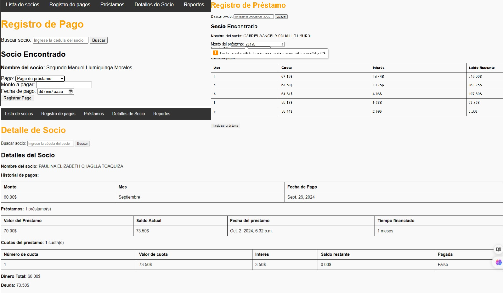

# Bank Fega - Sistema de Gestión para Mini Cooperativa

Bank Fega es una aplicación web desarrollada con **Python y Django** para la administración de una mini cooperativa financiera. El sistema permite gestionar socios, registrar pagos mensuales, generar préstamos, calcular cuotas con interés y consultar el historial financiero de cada socio.

## Descripción del proyecto

Este proyecto fue creado como una solución administrativa para llevar el control de una mini cooperativa. La aplicación permite organizar la información de los socios, registrar sus aportes, controlar préstamos activos y visualizar saldos pendientes.

El sistema está enfocado en resolver una necesidad real: reemplazar registros manuales o archivos de Excel por una aplicación web sencilla, ordenada y funcional.

## Funcionalidades principales

- Registro y listado de socios.
- Búsqueda de socios por número de cédula.
- Registro de pagos mensuales.
- Registro de préstamos.
- Cálculo de cuotas de préstamo.
- Cálculo de intereses.
- Visualización del saldo restante.
- Consulta del historial de pagos por socio.
- Consulta de préstamos activos.
- Reportes básicos de ingresos, egresos y deuda.
- Interfaz web mediante plantillas HTML.

## Tecnologías utilizadas

- Python
- Django
- SQLite
- HTML
- CSS

## Capturas del sistema

### Detalle de socio

En esta vista se puede consultar la información principal del socio, su historial de pagos, préstamos registrados, cuotas y deuda pendiente.



### Registro de préstamo

Formulario para registrar préstamos, calcular cuotas, intereses y saldo restante.


### Registro de pago

Vista para registrar pagos de los socios y controlar cuotas pendientes.


## Instalación y ejecución local

1. Clonar el repositorio:

```bash
git clone https://github.com/Larksenio/Bank_Fega.git
2. Entrar a la carpeta del proyecto:
'cd Bank_Fega'
3. Crear un entorno virtual:
python -m venv venv
4. Activar el entorno virtual:
venv\Scripts\activate
5. Instalar dependencias:
pip install -r requirements.txt
6. Ejecutar migraciones:
python manage.py migrate
7. Iniciar el servidor:
python manage.py runserver
8. Abrir en el navegador:
http://127.0.0.1:8000/
## Estructura general del proyecto
Bank_Fega/
│
├── BanFega/              # Configuración principal del proyecto Django
├── socios/               # Aplicación principal del sistema
├── templates/socios/     # Plantillas HTML del sistema
├── manage.py             # Archivo de administración de Django
├── requirements.txt      # Dependencias del proyecto
└── README.md             # Documentación del proyecto
Estado del proyecto

Proyecto funcional en entorno local.
Repositorio disponible para revisión de código y demostración técnica.
